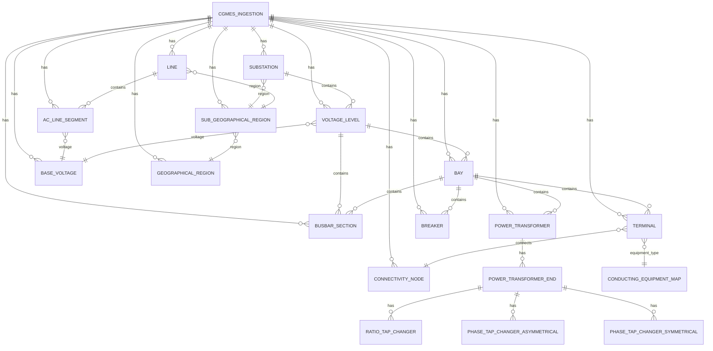

# Database Schema

## Entity-Relationship Diagram



## Overview

This SQLite database stores CGMES (Common Grid Model Exchange Standard) data parsed from XML files.

Each imported model is identified by `igm_name`, present in all entity tables.
There is also a special dataset named `_CommonData`, used for shared data such as base voltages and geographic regions.

## Design Decisions

1. Global entity IDs
- Every CGMES entity keeps its original `rdf:ID` as `id TEXT PRIMARY KEY`.
- No surrogate auto-increment keys are introduced.

2. Text-first storage
- Most technical values are stored as `TEXT`.
- Convert to numeric types (`float`, `int`) in downstream processing when needed.

3. EQ + TP consolidation
- `ConnectivityNode` and `Terminal` appear in both EQ and TP profiles.
- Rows are consolidated by `id` before persistence.

4. Pragmatic foreign keys
- Foreign keys are enforced where references are guaranteed in practice.
- Some references remain unconstrained to support cross-IGM links.

5. Equipment type index
- `conducting_equipment_map` maps `id -> equipment_type`.
- This avoids expensive UNION queries when resolving terminal equipment types.

## Core Relationship Map

```text
cgmes_ingestion (igm_name PK)
    substation
    voltage_level
    bay
    line
    busbar_section
    power_transformer
    power_transformer_end
    ac_line_segment
    breaker
    ratio_tap_changer
    phase_tap_changer_asymmetrical
    phase_tap_changer_symmetrical
    synchronous_machine
    generating_unit
    conform_load
    non_conform_load
    linear_shunt_compensator
    static_var_compensator
    series_compensator
    equivalent_injection
    conducting_equipment_map
    connectivity_node
    terminal
    base_voltage
    geographical_region
    sub_geographical_region
```

## Connectivity (Node-Breaker) Quick Reference

1. Every conducting element has one or more terminals.
2. Each terminal is linked to a connectivity node.
3. Breakers connect two terminals and can open/close the electrical path.
4. Downstream bus reduction can be built by traversing closed-breaker connectivity.

Useful query: all equipment connected to a node.

```sql
SELECT t.conducting_equipment_id, m.equipment_type, t.sequence_number
FROM terminal t
JOIN conducting_equipment_map m ON m.id = t.conducting_equipment_id
WHERE t.connectivity_node_id = '<connectivity-node-id>'
ORDER BY t.sequence_number;
```

Useful query: transformer end details.

```sql
SELECT e.end_number, e.rated_u, e.r, e.x, b.nominal_voltage
FROM power_transformer_end e
LEFT JOIN base_voltage b ON b.id = e.base_voltage_id
WHERE e.transformer_id = '<power-transformer-id>'
ORDER BY e.end_number;
```

Useful query: loaded datasets.

```sql
SELECT igm_name, source_folder, parsed_at_utc
FROM cgmes_ingestion
ORDER BY igm_name;
```

## Expected Counts for Example Data (IGM_Belgovia)

These values are useful for sanity checks in tests and demos.

| Table                         | Expected count |
|------------------------------|----------------|
| substation                   | 2              |
| voltage_level                | 6              |
| busbar_section               | 9              |
| power_transformer            | 4              |
| power_transformer_end        | 9              |
| ac_line_segment              | 10             |
| breaker                      | 20             |
| synchronous_machine          | 2              |
| generating_unit              | 2              |
| conform_load                 | 2              |
| non_conform_load             | 1              |
| equivalent_injection         | 8              |
| line                         | 2              |
| connectivity_node            | 35             |
| terminal                     | 96             |